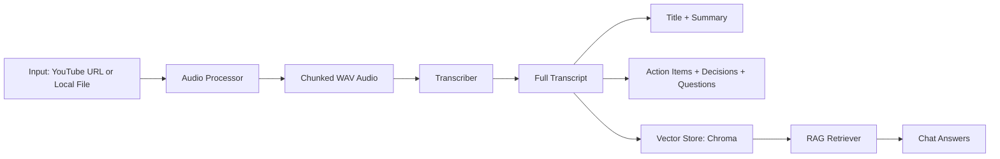

# CLIPMIND

AI-powered video and meeting intelligence assistant.

CLIPMIND converts YouTube links or local media into structured outputs you can use immediately:
- transcript
- concise summary
- action items
- key decisions
- open questions
- chat over transcript with RAG


## What Makes It Dynamic

- Accepts both YouTube URL and local file path input
- Switchable transcription mode:
	- english -> Whisper (local)
	- hinglish -> Sarvam STT translate API
- Live processing stages in Streamlit sidebar
- Retrieval-augmented QA over transcript content
- Persistent vector store for transcript embeddings

## Architecture



## Project Structure

```text
.
|-- app.py
|-- main.py
|-- core/
|   |-- extractor.py
|   |-- rag_engine.py
|   |-- summarizer.py
|   |-- transcriber.py
|   |-- vector_store.py
|-- utils/
|   `-- audio_processor.py
|-- Requirements.txt
|-- .env.example
`-- README.md
```

## Quick Start (Windows PowerShell)

```powershell
python -m venv .venv
.\.venv\Scripts\python.exe -m pip install --upgrade pip
.\.venv\Scripts\python.exe -m pip install -r Requirements.txt
Copy-Item .env.example .env
```

Edit .env and set your real keys:
- MISTRAL_API_KEY
- SARVAM_API_KEY (required only for hinglish mode)
- Optional: FFMPEG_BIN if ffmpeg is not in PATH

## Run The App

```powershell
.\.venv\Scripts\python.exe -m streamlit run app.py
```

Open: http://localhost:8501

## CLI Mode

You can also run the pipeline from terminal:

```powershell
.\.venv\Scripts\python.exe main.py
```

## Feature Matrix

| Feature | Status |
|---|---|
| YouTube audio ingestion | Available |
| Local file ingestion | Available |
| Auto conversion to WAV | Available |
| English transcription (Whisper local) | Available |
| Hinglish transcription + translation (Sarvam) | Available |
| Summaries + title generation | Available |
| Action items extraction | Available |
| Key decisions extraction | Available |
| Open questions extraction | Available |
| Transcript RAG chat | Available |

## Environment Variables

Use .env (never commit secrets):

```env
MISTRAL_API_KEY=your_mistral_api_key_here
SARVAM_API_KEY=your_sarvam_api_key_here
FFMPEG_BIN=C:\path\to\ffmpeg\bin
WHISPER_MODEL=tiny
SARVAM_STT_MODEL=saaras:v2.5
```

## Security Notes

- .env is ignored by git and must remain private
- If a key was ever exposed, rotate it immediately at the provider dashboard

## Common Issues

1. FFmpeg not found
- Install FFmpeg or set FFMPEG_BIN in .env

2. Sarvam errors for long audio
- The code already slices audio into short pieces before API calls

3. Slow first run with Whisper
- Initial model download/loading can take time

## Roadmap

- Add speaker diarization support in transcript views
- Add export options for summary/report bundles
- Add Docker support for one-command setup

## License

Choose a license and add a LICENSE file (MIT is a common default).
